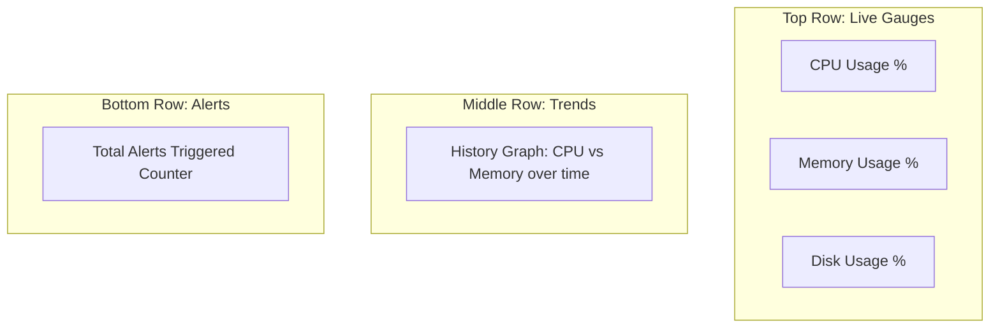

# ?? System Health Dashboard Preview

This file contains the visual layout and description of the Grafana dashboard for the System Health Monitor project.

## Dashboard Layout
The dashboard is organized into the following sections:

## How to add your own screenshot
1. Open your dashboard at `http://localhost:3000`.
2. Take a screenshot of the page.
3. Save the image as `dashboard-screenshot.png` in the project root.
4. Replace the placeholder below with your file path.

> 
