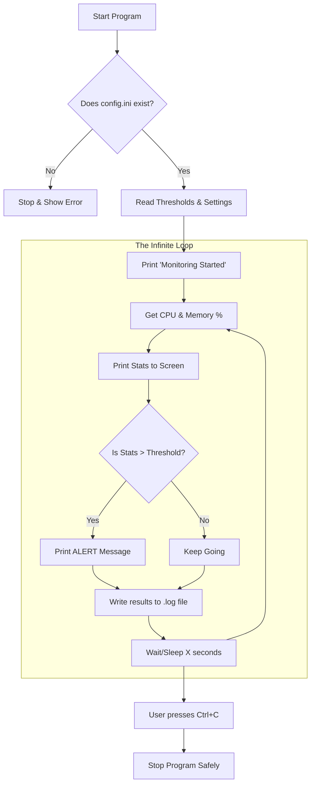

# ?? How Your System Health Monitor Works

Since you are new to programming, think of this program like a **Medical Monitor** in a hospital. Instead of a patient, it is watching your **Computer**.

---

## 1. The Simple Flow (The "Story")

1.  **Preparation:** The program wakes up and looks for its "Rulebook" (`config.ini`).
2.  **Reading Rules:** It reads what the "Danger Zones" are (e.g., CPU > 75% is bad).
3.  **The Checkup Loop:** Every few seconds, it performs a checkup:
    *   **Measure:** It checks how hard the CPU and Memory are working.
    *   **Report:** It prints the results on your screen.
    *   **Alert:** If the numbers are too high (based on the Rulebook), it screams "ALERT!".
    *   **Record:** It writes the results into a "Medical Chart" (`health_monitor.log`).
4.  **Rest:** It takes a short nap (e.g., 10 seconds) and then repeats the checkup.

---

## 2. Execution Diagram

Here is a visual map of what happens inside the code:

---

## 3. What do the weird words mean?

If you look at your `monitor.py` file, here is what those coding terms actually mean:

*   **`import`**: Think of this as "grabbing tools." We grab the `psutil` tool for measuring and `time` for the clock.
*   **`while True`**: This creates an **infinite loop**. It means "do this forever until I manually stop you."
*   **`if __name__ == "__main__":`**: This is just Python's way of saying "Start here."
*   **`try / except`**: This is "Safety Mode." If the user presses `Ctrl+C` to stop, the `except` part catches that and exits cleanly instead of crashing.
*   **`config.ini`**: This is your **External Brain**. It stores settings so you don't have to change the actual code.

---

## 4. How to Test It
To see the program "react," open your `config.ini` and change `cpu_max = 75` to `cpu_max = 1`. 
Because your CPU is almost always using more than 1%, the program will start alerting immediately!
