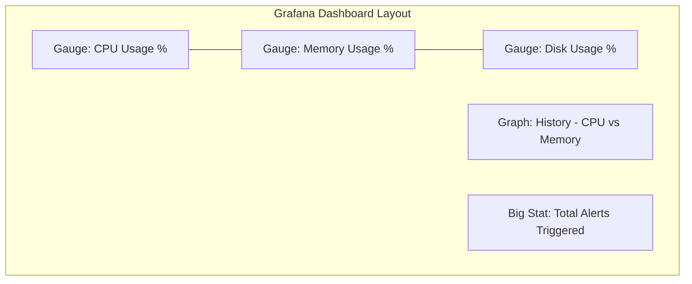

# 🩺 System Health Monitor & Observability Stack


A beginner-friendly DevOps project that monitors your computer's health using a Python agent, Prometheus for data storage, and Grafana for beautiful visualizations.

---

## 📖 Overview
This project acts like a **Medical Monitor** for your computer. It tracks vital signs (CPU, Memory, Disk), alerts you when "danger zones" are reached, and visualizes everything in a professional web dashboard.

---

## 🛠️ How it was Built (The Development Journey)
If you are looking at this project for the first time, here is the flow of how it was created:

1.  **Step 1: The Agent (`monitor.py`)**: We wrote a Python script using the `psutil` library to collect real-time data from the operating system.
2.  **Step 2: The Logic (`config.ini`)**: We separated the settings from the code. This allows any user to change the "Danger Zone" thresholds without touching the Python script.
3.  **Step 3: The Storage (Prometheus)**: We integrated a Prometheus client into the Python script so that our data could be "scraped" and stored in a time-series database.
4.  **Step 4: The Visualization (Grafana)**: We used Grafana to build a dashboard that connects to Prometheus, turning raw numbers into beautiful, easy-to-read graphs.
5.  **Step 5: The Orchestrator (Docker)**: Finally, we packaged everything into Docker containers and used `docker-compose` so that the entire system can be launched with a single command.

---

## 🔄 The Data Flow
This is how information moves through the system:
**Your PC** ➡️ **Python Monitor** ➡️ **Prometheus (Database)** ➡️ **Grafana (Dashboard)**

---

## 🚀 Getting Started (The Easy Way)

### 1️⃣ Prerequisites
- Install [Docker Desktop](https://www.docker.com/products/docker-desktop/).

### 2️⃣ Launch the System
Open your terminal in this folder and run:
```bash
docker-compose up -d --build
```

### 3️⃣ Explore the Results
- **Grafana Dashboard**: [http://localhost:3000](http://localhost:3000) (User: `admin` / Pass: `admin`)
- **Raw Metrics API**: [http://localhost:8000/metrics](http://localhost:8000/metrics)

---

## 📊 Dashboard Preview
The Grafana dashboard is automatically provisioned and includes:



---

## 🧪 How to Test the "Alerts"
To see the system react to "high stress":
1. Open **`config.ini`**.
2. Change `cpu_max = 75` to **`cpu_max = 1`**.
3. Save the file.
4. Watch the **"Total Alerts"** counter on the Grafana dashboard increase!

---

## 📂 Project Structure
```text
├── monitor.py          # The "Brain" (Metric collection)
├── config.ini          # The "Rules" (Thresholds)
├── Dockerfile          # The "Blueprint" (Container config)
├── docker-compose.yml  # The "Orchestrator" (Running the stack)
├── prometheus.yml      # The "Collector" (Scraping rules)
├── grafana/            # The "Painter" (Dashboards & Visuals)
└── tests/              # The "Safety Check" (Automated tests)
```
