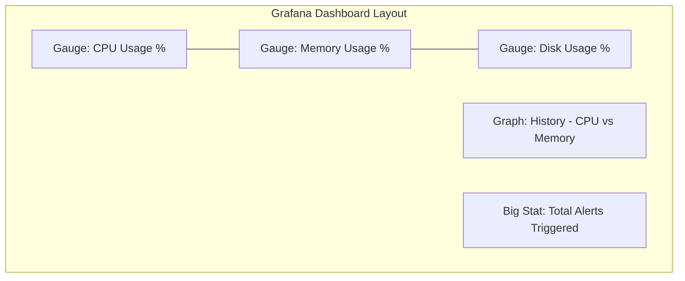

# ?? System Health Monitor & Observability Stack


A complete DevOps project featuring a real-time system health monitor, automated observability with Prometheus and Grafana, and full containerization.

---

## ?? Overview
This system acts like a **Medical Monitor** for your computer. It tracks vital signs (CPU, Memory, Disk), alerts you when "danger zones" are reached, and visualizes everything in a beautiful web dashboard.

## ?? Key Features
- **Real-time Monitoring**: Tracks CPU, Virtual Memory, and Disk usage via Python.
- **Configurable Thresholds**: Easily adjust "Alert Limits" via an external `config.ini`.
- **Automated Observability**: Exports metrics to Prometheus and visualizes them in Grafana.
- **Zero-Config Setup**: Docker Compose launches the entire stack (Monitor, Database, Dashboard) in seconds.
- **Continuous Integration**: Every change is automatically tested using GitHub Actions.

---

## ?? The Technology Stack
| Tool | Purpose |
| :--- | :--- |
| **Python** | Logic & Metric Collection |
| **Prometheus** | Time-Series Database for metrics |
| **Grafana** | Data Visualization Dashboard |
| **Docker** | Containerization & Portability |
| **GitHub Actions** | Automated Testing (CI) |

---

## ?? Dashboard Preview
The Grafana dashboard is automatically provisioned and includes:



*Actual Dashboard screenshot can be added here by replacing this placeholder:*
> 

---

## ?? Getting Started

### 1. Prerequisites
- [Docker Desktop](https://www.docker.com/products/docker-desktop/) installed.

### 2. Launch the Stack
Clone the repo and run:
```bash
docker-compose up -d --build
```

### 3. View the Results
- **Grafana Dashboard**: `http://localhost:3000` (Login: `admin` / `admin`)
- **Prometheus Metrics**: `http://localhost:9090`
- **Health Monitor API**: `http://localhost:8000/metrics`

---

## ?? How to Test Alerts
1. Open `config.ini`.
2. Set `cpu_max = 1`.
3. Save the file.
4. Watch the **"Total Alerts"** counter on the Grafana dashboard increase in real-time!

---

## ?? Project Structure
```text
├── monitor.py          # Core monitoring logic
├── config.ini          # User settings & thresholds
├── Dockerfile          # Container instructions
├── docker-compose.yml  # Multi-container orchestration
├── prometheus.yml      # Metric collection config
├── grafana/            # Provisioned dashboards & datasources
└── tests/              # Automated logic tests
```
